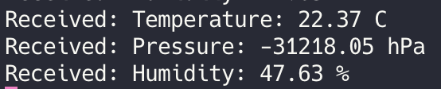
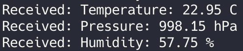
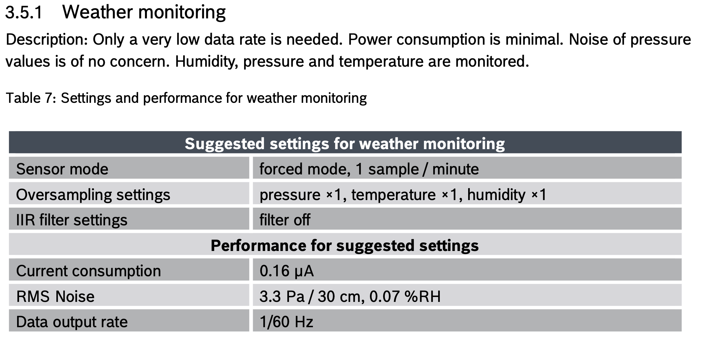

# Tropo Sense

## How It began?

I started working on the first version of this project a few years ago, and originally it was supposed to look quite different. I was inspired by the [weather station project](https://projects.raspberrypi.org/en/projects/build-your-own-weather-station) created by the Raspberry Pi team, However, I felt it was missing a few things.

Most importantly, it requires both a Wi-Fi and a constant power connection — which, in my case, isn't really an option. So, I decided to modify the idea to better suit my needs. And that’s how the journey began.

## Previous setup


At the time of writing this, the weather station is disassembled due to some issues I encountered (more on that in a moment). But let’s go over the setup as it was.

### Sensors:
- [Weather meter kit](https://www.sparkfun.com/weather-meter-kit.html) from SparkFun — includes an anemometer, rain gauge, and wind vane.
- **BME280** - Measures temperature, humidity, and atmospheric pressure.
- **DS18B20** - Measures ground temperature.

### Power:
- **Solar panel** - I'm using an 18V, 10W panel from Waveshare.
- **Power bank** - Also from Waveshare, powered by 3 × Samsung 18650 35E batteries.

### Communication:
- **GSM** - A7670E, used for sending data (Waveshare part nr. 20049).

### Cooridination:
- **Raspberry PI Zero** - Responsible for collecting sensor data and sending it out.
- **Witty Pi 4 Mini** - Controls when the Pi is powered on/off to save energy.
- **AVR ATMega 8A** - Dedicated to collecting real-time data from the anemometer, rain gauge, and wind vane.

### Other:
- 1.5-meter tall 1-inch steel pipe the setup
- 3D-printed mounts for all sensors and enclosures.
- OBO waterproof enclosures for components

### A look inside the coordination box:


As you can see, some parts are tidy... some are not. It works — most of the time — but overall, this setup turned out to be both unreliable and overcomplicated.

Initially, I mounted everything on another steel pipe to make it easy to remove without disturbing the ground. I tried using a 3D-printed connector for this, but as it turns out…


…it wasn’t exactly the strongest solution 😅

## Current issues
### SPI Interface
Like I mentioned earlier — it mostly works, but not always. The main problem lies in the SPI interface I used, which has caused issues from the very beginning. The clock signal would sometimes fail to sync, and during a Raspberry Pi power cycle, there wasn’t always enough time to send data before shutdown, resulting in lost information.

To make things worse, data occasionally got corrupted. For example, the system once registered 400 mm of rainfall in just 15 minutes — clearly incorrect.

### Power efficiency
Another major issue is power efficiency. Initially, I ran the Raspberry Pi Zero alone — and while it only consumes around 80 mA, if it's on 24/7, the batteries drain surprisingly quickly.

Adding the Witty Pi and AVR helped somewhat by allowing the Pi to remain off most of the time. However, this also made the setup more complex, and communication issues started popping up.

The core of the problem remains the GSM module. Despite optimizing some parts of the system, the GSM module still causes short bursts of high power draw. I’m hoping these spikes aren’t too damaging in the long run — but they definitely aren’t ideal for a low-power, off-grid system.

## Remake process
I decided to remake the project — the right, but harder, way. This time, without using a Raspberry Pi. Instead, I want to rely entirely on AVR microcontrollers and design a dedicated circuit specifically for this project. This approach should make the system more reliable, cleaner, and potentially even cheaper.

At first I thought new setup could look like this:
- ***AVR1***: Responsible for reading real-time data (wind, and rain)
- ***AVR2***: Responsible for reading non-real-time data (BME280 and DS18B20)
- ***AVR3***: Responsible for sending data over GSM
- ***AVR4***: Responsible for coordination

However, I soon realized that AVRs ***2, 3*** and ***4*** can be merged into one microcontroller. This would likely be most efficient and straightforward setup — the only concern is whether flash memory will be enough. Still, it’s worth testing.

### Final setup:
- ***AVR1***: Handles non-real-time sensors (BME280 and DS18B20), collects data from AVR2, and sends everything over GSM.
- ***AVR2***: Handles real-time sensors (anemometer and rain gauge).

### Some additional components:
- ***DS3231*** - A low-power real-time clock with an alarm function. It will wake up AVR1 periodically, acting as a timer to initiate data collection and transmission.
- ***IRLZ34N N-MOSFET*** - Used to control power to the GSM module, allowing AVR1 to turn it on and off as needed.

### Interfaces:
- ***AVR1*** ↔ ***AVR2*** - I²C
- ***AVR1*** ↔ ***RTC***  - I²C
- ***AVR1*** ↔ ***GSM*** - UART
- ***AVR1*** ↔ ***BME280*** - I²C
- ***AVR1*** ↔ ***DS18B20*** - 1-wire

### Microcontrollers:
- ***AVR1*** - ATmega328P
- ***AVR2*** - ATtiny85

I chose the **ATtiny85** because of its small size, low power consumption, and just enough flash memory to handle the simpler real-time sensing tasks. The **ATmega328P**, on the other hand, offers significantly more flash memory and peripherals, making it better suited to handle communication protocols, data processing, and coordination logic. 

### Development Tools
For development and flashing firmware, I use avrdude running on a Raspberry Pi over SPI. This setup is simple, inexpensive, and gives me full control during development. I write code in plain C using AVR-GCC, and manage everything with Makefiles.

### Power Strategy
To balance power efficiency and data accuracy, my current idea is to have the station wake up every 15 minutes to read sensor data and transmit it. This interval should be frequent enough for most weather monitoring purposes while still conserving energy. Later on, I might implement data buffering, allowing the system to store several readings locally and transmit them in batches, which would reduce the number of GSM module activations — potentially improving both battery life.

## DS18B20
In this section, I’ll walk through how I communicate with the **DS18B20** temperature sensor using the 1-Wire protocol. You can find the datasheet [here](https://www.alldatasheet.com/datasheet-pdf/view/58557/DALLAS/DS18B20.html).

### 🔧 Helper Functions
These functions help control the state of the pin used for 1-Wire communication.
```c
void one_wire_setOutput() {
    ONE_WIRE_DDR |= (1 << ONE_WIRE_PIN);
}

void one_wire_setInput() {
    ONE_WIRE_DDR &= ~(1 << ONE_WIRE_PIN);
}

void one_wire_pullLow() {
    ONE_WIRE_PORT &= ~(1 << ONE_WIRE_PIN);
}

void one_wire_release() {
    ONE_WIRE_PORT |= (1 << ONE_WIRE_PIN);
}

uint8_t one_wire_readPin() {
    return (ONE_WIRE_PIN_REG & (1 << ONE_WIRE_PIN));
}
```
### 📝 Writing data
(See page 19 of the datasheet – "**Write Time Slots**")

```c
void one_wire_writeBit(uint8_t bit) {
    one_wire_setOutput();
    one_wire_pullLow();
    _delay_us(2);

    if (bit) one_wire_release();

    _delay_us(60);
    one_wire_release();
}

void one_wire_writeByte(uint8_t data) {
    for (uint8_t i = 0; i < 8; i++) {
        one_wire_writeBit(data & 0x01);
        data >>= 1;
    }
}
```

### 📥 Reading Data
(See page 19 of the datasheet - "**Read Time Slots**")

```c
uint8_t one_wire_readBit() {
    one_wire_setOutput();
    one_wire_pullLow();
    _delay_us(2);

    one_wire_release();
    one_wire_setInput();
    _delay_us(10);

    uint8_t bit = one_wire_readPin();
    _delay_us(50);

    return bit;
}

uint8_t one_wire_readByte() {
    uint8_t data = 0;
    for (uint8_t i = 0; i < 8; i++) {
        data >>= 1;
        if (one_wire_readBit()) data |= 0x80;
    }
    return data;
}
```

### 🔄 Reset & Presence Pulse
(See page 14 – "**Initialization**")

```c
uint8_t one_wire_reset() {
    one_wire_setOutput();
    one_wire_pullLow();
    _delay_us(480);
    one_wire_release();
    one_wire_setInput();

    _delay_us(70);
    uint8_t presence = !one_wire_readPin();
    _delay_us(410);

    return presence;
}
```

### 🌡️ Reading the Temperature
Here’s the sequence for reading the temperature from a single DS18B20 sensor:

```
Reset → Skip ROM [0xCC] → Convert T [0x44] → Wait → Reset → Skip ROM [0xCC] → Read Scratchpad [0xBE]
```

This is almost identical to the example in **Table 5** (page 22). The delay depends on the resolution (see **Table 3**, page 9).

```c
int16_t ds18b20_readTemperature() {
    if (!one_wire_reset()) return -1000;

    one_wire_writeByte(0xCC);  // Skip ROM
    one_wire_writeByte(0x44);  // Start temperature conversion

    _delay_ms(750);

    if (!one_wire_reset()) return -1000;

    one_wire_writeByte(0xCC);
    one_wire_writeByte(0xBE);  // Read Scratchpad

    uint8_t lsb = one_wire_readByte();
    uint8_t msb = one_wire_readByte();

    return ((msb << 8) | lsb);
}
```

## BME280
Setting up the BME280 took me way more time than the DS18B20. At first, I got results like these:


Then this:




And finally, success:




These initial problems were caused by some really tiny mistakes — which made debugging incredibly frustrating. Because the errors were so subtle, it took a while to spot and fix them. But once I did, it worked great. Here’s the working code, starting with the I2C interface I used to talk to the sensor.

### 🧩 I²C Setup
Before jumping into the code — one very important reminder:
**Use pull-up resistors** on both SDA and SCL lines. I used 4.7kΩ resistors.
Without them, I2C might just silently fail or give garbage data.

### 🛠 Initialization

```c
void I2C_init() {
    TWSR = 0x00;          // Prescaler set to 1
    TWBR = 32;            // SCL = F_CPU / (16 + 2*TWBR*4^TWPS), adjust for speed
    TWCR = (1 << TWEN);   // Enable TWI
}
```

### 🚦 Start Condition
To begin communication, we:
1. Set the `TWSTA` bit to start transmission.
2. Clear ``TWINT`` (by writing 1), which triggers the action.
3. Wait for ``TWINT`` to go high again — this signals that the start condition was sent.

```c
void I2C_start() {
    TWCR = (1 << TWSTA) | (1 << TWEN) | (1 << TWINT);
    while (!(TWCR & (1 << TWINT)));  // Wait for completion
}
```

### 📤 Writing a Byte
To send data:
1. Load your byte into ``TWDR``.
2. Set ``TWINT`` to start transmission.
3. Wait for it to complete.

```c
void I2C_write(uint8_t data) {
    TWDR = data;
    TWCR = (1 << TWEN) | (1 << TWINT);
    while (!(TWCR & (1 << TWINT)));  // Wait for completion
}
```

### 🧭 Selecting the Device
On an I²C bus, you can use multiple devices.
You must send the 7-bit address + a read/write bit. This function does both:

```c
void I2C_start_with_address(uint8_t address, uint8_t read) {
    I2C_start();  // Initiate start condition
    I2C_write((address << 1) | read);  // Send device address with R/W bit
}
```

#### 🛑 Stop Condition
Similar to the start — this sends the stop condition on the bus.

```c
void I2C_stop() {
    TWCR = (1 << TWSTO) | (1 << TWEN) | (1 << TWINT);
    while (! (TWCR & (1<<TWSTO)));
}
```

### 📥 Reading from the Bus
There are two types of reads:

- **ACK** (Acknowledge): If you expect more data afterward.
- **NACK** (No Acknowledge): If it’s the last byte you want to read.

```c
uint8_t I2C_read_ack() {
    TWCR = (1 << TWEN) | (1 << TWINT) | (1 << TWEA);
    while (!(TWCR & (1 << TWINT)));

    return TWDR;
}

uint8_t I2C_read_nack() {
    TWCR = (1 << TWEN) | (1 << TWINT);
    while (!(TWCR & (1 << TWINT)));

    return TWDR;
}
```

In this section i will refer to [BME280 datasheet](https://www.bosch-sensortec.com/media/boschsensortec/downloads/datasheets/bst-bme280-ds002.pdf).

> ⚠️ This code is based on the original `bme280.c` driver created by Michael Köhler (2017), 
> distributed under the GPL-3.0 license. Significant modifications were made for use in this project.

### 📥 Read 1 Byte
```c
uint8_t bme280_read1Byte(uint8_t reg) {
    uint8_t value;
    I2C_start_with_address(BME280_ADDR, 0);
    I2C_write(reg);
    I2C_stop();

    I2C_start_with_address(BME280_ADDR, 1);
    value = I2C_read_nack();
    I2C_stop();
    
    return value;
}
```
### 📥 Read 2 or 3 Bytes
Reading 2 or 3 bytes is very similar — we read the bytes sequentially, acknowledge each one except the last, and combine them into a single variable.

For **2 bytes**: ACK → NACK

For **3 bytes**: ACK → ACK → NACK

### 🔧 Helper Functions
```c
// Read 16-bit value from the register (Little Endian)
uint16_t read16_LE(uint8_t reg) {
    uint16_t temp = bme280_read2Byte(reg);
    return (temp >> 8) | (temp << 8); 
}

// Read signed 16-bit value
int16_t readS16(uint8_t reg) {
    return (int16_t)bme280_read2Byte(reg);
}

// Read signed 16-bit value (Little Endian)
int16_t readS16_LE(uint8_t reg) {
    return (int16_t)read16_LE(reg);
}
```

### 📋 Read Calibration Data

The BME280 provides compensation coefficients stored in its non-volatile memory. These must be read and used in calculations for accurate temperature, pressure, and humidity values.

Registry addresses are described in table 16 (**Page 24**).

```c
void bme280_readCoefficients() {
    dig_T1 = read16_LE(BME280_REGISTER_DIG_T1);
    dig_T2 = readS16_LE(BME280_REGISTER_DIG_T2);
    dig_T3 = readS16_LE(BME280_REGISTER_DIG_T3);

    // And similarly for pressure and humidity coefficients...
}
```

### ⚙️ Initialization

This function resets the sensor, sets up configuration registers, and reads all calibration values.
In table 7 (**page 19**), manufacturer suggests settings for weather monitoring:


```c
// Initialize the BME280 sensor
void bme280_init() {
    // Perform a soft reset
    I2C_start_with_address(BME280_ADDR, 0);
    I2C_write(BME280_REGISTER_SOFTRESET); // Send reset 
    I2C_write(BME280_REGISTER_POWERONRESET); // use the complete power-on procedure
    I2C_stop();
    
    // Then set registers and read calibration values
}
```

### 🌡️ Reading Temperature
Registry addresses are described in table 18 (**Page 27**)

```c
float bme280_readTemperature() {    
    int32_t var1, var2;

    uint32_t adc_T = bme280_read3Byte(BME280_REGISTER_TEMPDATA);
    
    // Apply compensation algorithm (based on datasheet)
    // t_fine = ...
    // return temperature in °C as float
}
```

### 🌬️ Reading Pressure
Registry addresses are described in table 18 (**Page 27**)

```c
float bme280_readPressure() {    
    int64_t var1, var2, p;
    
    bme280_readTemperature(); // must be done first to get t_fine
    
    int32_t adc_P = bme280_read3Byte(BME280_REGISTER_PRESSUREDATA);
    
    // Apply compensation formula from datasheet
    // return pressure in hPa as float
}
```

### 💧 Reading Humidity
Registry addresses are described in table 18 (**Page 27**)

```c
float bme280_readHumidity() {    
    int32_t v_x1_u32r;
    bme280_readTemperature(); // must be done first to get t_fine
    
    int32_t adc_H = bme280_read2Byte(BME280_REGISTER_HUMIDDATA);
    
    // Apply compensation formula from datasheet
    // return humidity in %RH as float
}
```