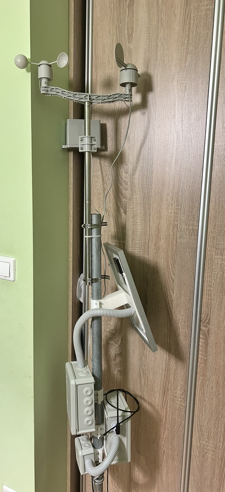
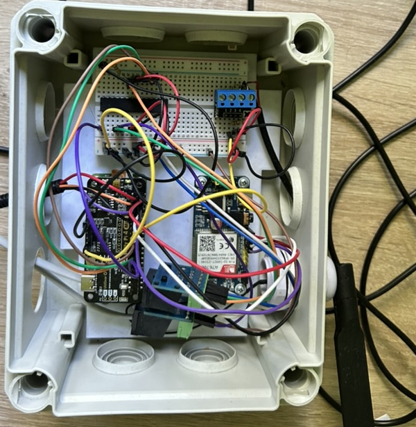
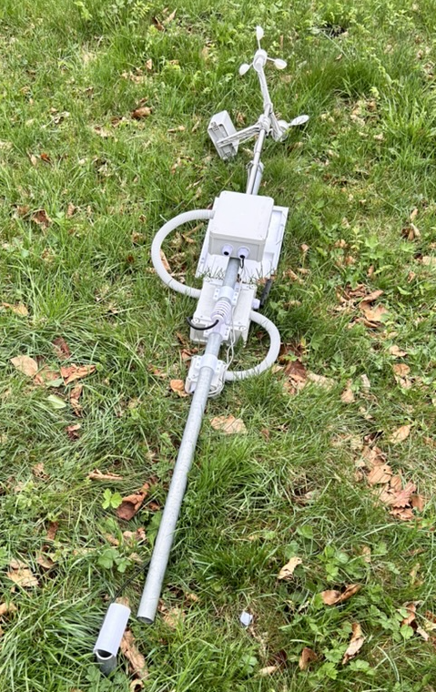

# Tropo Sense

## How It began?

I started working on the first version of this project a few years ago, and originally it was supposed to look quite different. I was inspired by the [weather station project](https://projects.raspberrypi.org/en/projects/build-your-own-weather-station) created by the Raspberry Pi team, However, I felt it was missing a few things.

Most importantly, it requires both a Wi-Fi and a constant power connection — which, in my case, isn't really an option. So, I decided to modify the idea to better suit my needs. And that’s how the journey began.

## Previous setup

At the time of writing this, the weather station is disassembled due to some issues I encountered (more on that in a moment). But let’s go over the setup as it was.

### Sensors:
- [Weather meter kit](https://www.sparkfun.com/weather-meter-kit.html) from SparkFun — includes an anemometer, rain gauge, and wind vane.
- **BME280** - Measures temperature, humidity, and atmospheric pressure.
- **DS18B20** - Measures ground temperature.

### Power:
- **Solar panel** - I'm using an 18V, 10W panel from Waveshare.
- **Power bank** - Also from Waveshare, powered by 3 × Samsung 18650 35E batteries.

### Communication:
- **GSM** - A7670E, used for sending data (Waveshare part nr. 20049).

### Cooridination:
- **Raspberry PI Zero** - Responsible for collecting sensor data and sending it out.
- **Witty Pi 4 Mini** - Controls when the Pi is powered on/off to save energy.
- **AVR ATMega 8A** - Dedicated to collecting real-time data from the anemometer, rain gauge, and wind vane.

### Other:
- 1.5-meter tall 1-inch steel pipe the setup
- 3D-printed mounts for all sensors and enclosures.
- OBO waterproof enclosures for components

### A look inside the coordination box:

As you can see, some parts are tidy... some are not. It works — most of the time — but overall, this setup turned out to be both unreliable and overcomplicated.

Initially, I mounted everything on another steel pipe to make it easy to remove without disturbing the ground. I tried using a 3D-printed connector for this, but as it turns out…

…it wasn’t exactly the strongest solution 😅

## Current issues
### SPI Interface
Like I mentioned earlier — it mostly works, but not always. The main problem lies in the SPI interface I used, which has caused issues from the very beginning. The clock signal would sometimes fail to sync, and during a Raspberry Pi power cycle, there wasn’t always enough time to send data before shutdown, resulting in lost information.

To make things worse, data occasionally got corrupted. For example, the system once registered 400 mm of rainfall in just 15 minutes — clearly incorrect.

### Power efficiency
Another major issue is power efficiency. Initially, I ran the Raspberry Pi Zero alone — and while it only consumes around 80 mA, if it's on 24/7, the batteries drain surprisingly quickly.

Adding the Witty Pi and AVR helped somewhat by allowing the Pi to remain off most of the time. However, this also made the setup more complex, and communication issues started popping up.

The core of the problem remains the GSM module. Despite optimizing some parts of the system, the GSM module still causes short bursts of high power draw. I’m hoping these spikes aren’t too damaging in the long run — but they definitely aren’t ideal for a low-power, off-grid system.

## Remake process
I decided to remake the project — the right, but harder, way. This time, without using a Raspberry Pi. Instead, I want to rely entirely on AVR microcontrollers and design a dedicated circuit specifically for this project. This approach should make the system more reliable, cleaner, and potentially even cheaper.

At first I thought new setup could look like this:
- ***AVR1***: Responsible for reading real-time data (wind, and rain)
- ***AVR2***: Responsible for reading non-real-time data (BME280 and DS18B20)
- ***AVR3***: Responsible for sending data over GSM
- ***AVR4***: Responsible for coordination

However, I soon realized that AVRs ***2, 3*** and ***4*** can be merged into one microcontroller. This would likely be most efficient and straightforward setup — the only concern is whether flash memory will be enough. Still, it’s worth testing.

### Final setup:
- ***AVR1***: Handles non-real-time sensors (BME280 and DS18B20), collects data from AVR2, and sends everything over GSM.
- ***AVR2***: Handles real-time sensors (anemometer and rain gauge).

### Some additional components:
- ***DS3231*** - A low-power real-time clock with an alarm function. It will wake up AVR1 periodically, acting as a timer to initiate data collection and transmission.
- ***IRLZ34N N-MOSFET*** - Used to control power to the GSM module, allowing AVR1 to turn it on and off as needed.

### Interfaces:
- ***AVR1*** ↔ ***AVR2*** - I²C
- ***AVR1*** ↔ ***RTC***  - I²C
- ***AVR1*** ↔ ***GSM*** - UART
- ***AVR1*** ↔ ***BME280*** - I²C
- ***AVR1*** ↔ ***DS18B20*** - 1-wire

### Microcontrollers:
- ***AVR1*** - ATmega328P
- ***AVR2*** - ATtiny85

I chose the **ATtiny85** because of its small size, low power consumption, and just enough flash memory to handle the simpler real-time sensing tasks. The **ATmega328P**, on the other hand, offers significantly more flash memory and peripherals, making it better suited to handle communication protocols, data processing, and coordination logic. 

### Development Tools
For development and flashing firmware, I use avrdude running on a Raspberry Pi over SPI. This setup is simple, inexpensive, and gives me full control during development. I write code in plain C using AVR-GCC, and manage everything with Makefiles.

### Power Strategy
To balance power efficiency and data accuracy, my current idea is to have the station wake up every 15 minutes to read sensor data and transmit it. This interval should be frequent enough for most weather monitoring purposes while still conserving energy. Later on, I might implement data buffering, allowing the system to store several readings locally and transmit them in batches, which would reduce the number of GSM module activations — potentially improving both battery life.

